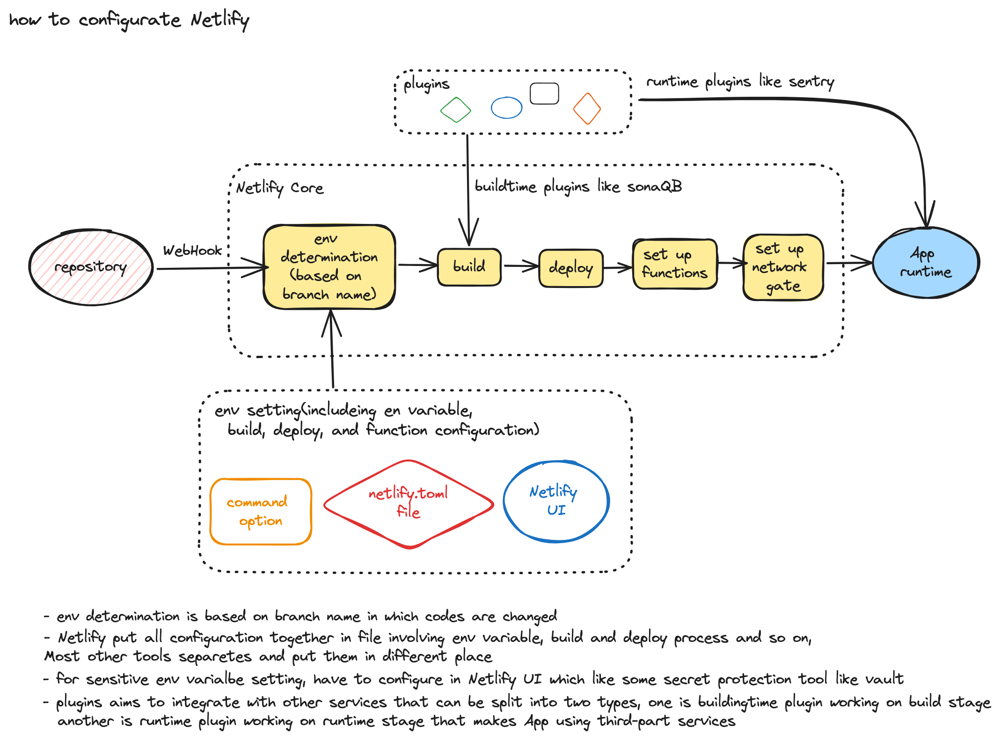
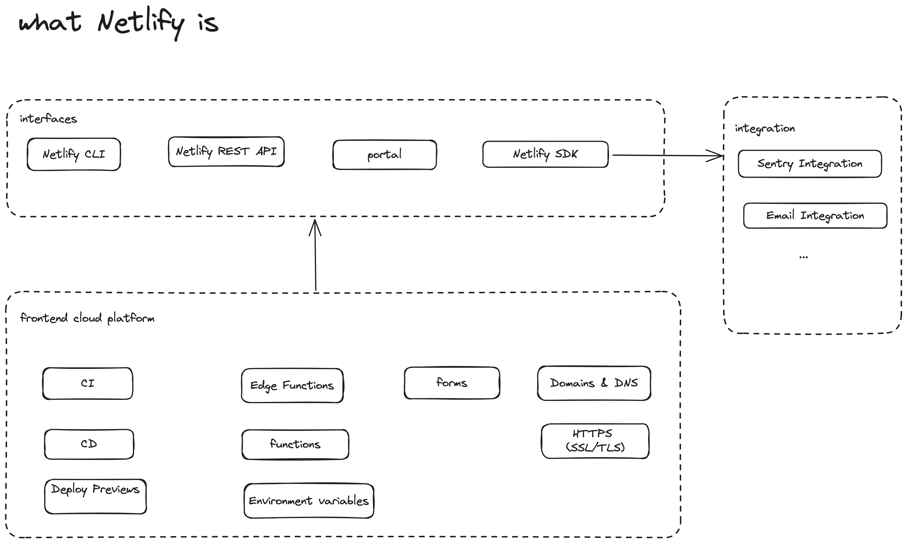

# Netlify Feature Tour

**Access this demo site**: https://feature-tour.netlify.app

[](https://app.netlify.com/sites/feature-tour/deploys)

## About this example site(new Project)

This site provides a path to get started learning about Netlify features.

- 📚 [Docs Getting Started Tutorial](https://docs.netlify.com/get-started/?utm_medium=social&utm_source=github&utm_campaign=devex-ph&utm_content=devex-examples)

#### Speedily deploy your own version

Deploy your own version of this example site by selecting the Deploy to Netlify Button below. This will automatically:

- Clone a copy of this repo to your own GitHub account
- Create a new project in your [Netlify account](https://app.netlify.com/?utm_medium=social&utm_source=github&utm_campaign=devex&utm_content=devex-examples), linked to your new repo
- Create an automated deployment pipeline to watch for changes on your repo
- Build and deploy your new site

[](https://app.netlify.com/start/deploy?repository=https://github.com/netlify/netlify-feature-tour&utm_medium=social&utm_source=github&utm_campaign=devex&utm_content=devex-examples)

#### Install and run this example locally

You can clone this example repo to explore its features and implementation and to run it locally.

```shell

# 1. Clone the repository to your local development environment
git clone git@github.com:netlify/feature-tour.git

# 2. Move into the project directory
cd feature-tour

# 3. Install code dependencies
npm install

# 4. Install the Netlify CLI to let you locally serve your site using Netlify's features
npm install -g netlify-cli

# 5. Serve your site using Netlify Dev
netlify dev

```

## For project already existing
- 📚 [Get started with Netlify CLI](https://docs.netlify.com/cli/get-started/)

  key takeaways as follows
  1. Authentication
      
      run command `netlify login`
  2. Continuous deployment
      
      run command `netlify init` or `netlify init --manual` which leave you to manually add the key and webhook URL to your Git provider, those inforamation is offered by Netlify CLI
  3. Get started with Netlify Dev

      > `Netlify Dev` brings the functionality of your Netlify production environment directly to your local machine. It provides a proxy server that includes edge logic for custom headers and redirects, environment variables, and Netlify Functions.

      run command `netlify dev` or `netlify dev --context production`

  4. Run build locally
  5. Manual deployment
  6. Manage environment variables

      Use the --context and --scope flags with your CLI commands to set contextual or scope values

#### Configuration information
Netlify CLI will look for this information in three places, in the following order:

- in flags specified in the command itself.
- in a netlify.toml file stored at the root of your project directory.
- in your site configuration in the Netlify UI, if continuous deployment is set up for the site.

About how Netlify configure, please take a look at below diagram


## Netlify arcitecture diagram
Below diagram is just from my understanding



## Practises

[Nelify-feature-tour](https://github.com/unnKoel/netlify-feature-tour)

## References

[Get started with Netlify Core](https://docs.netlify.com/get-started/)

[Get started with Netlify CLI](https://docs.netlify.com/cli/get-started/)
